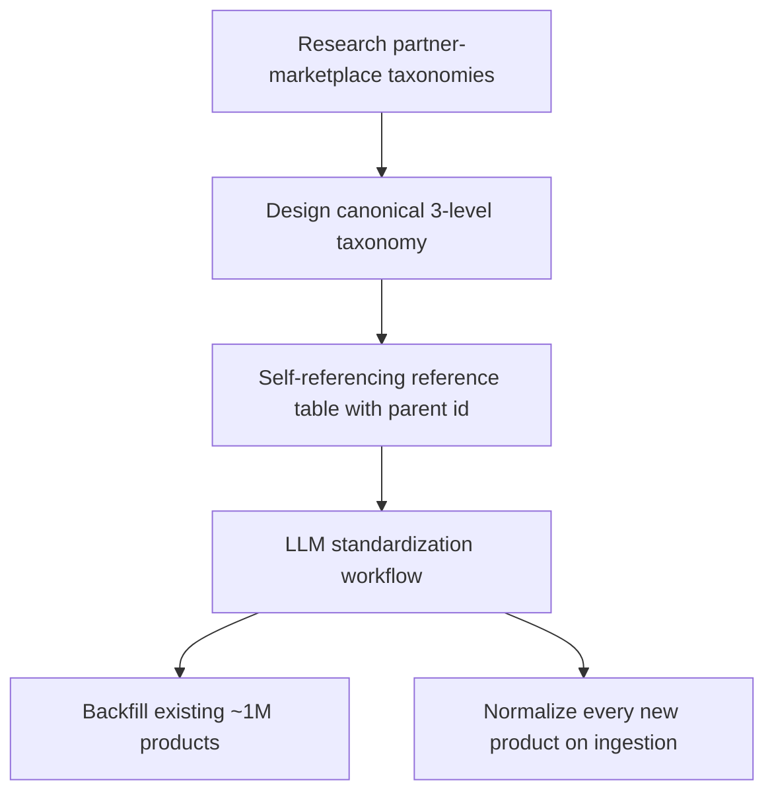
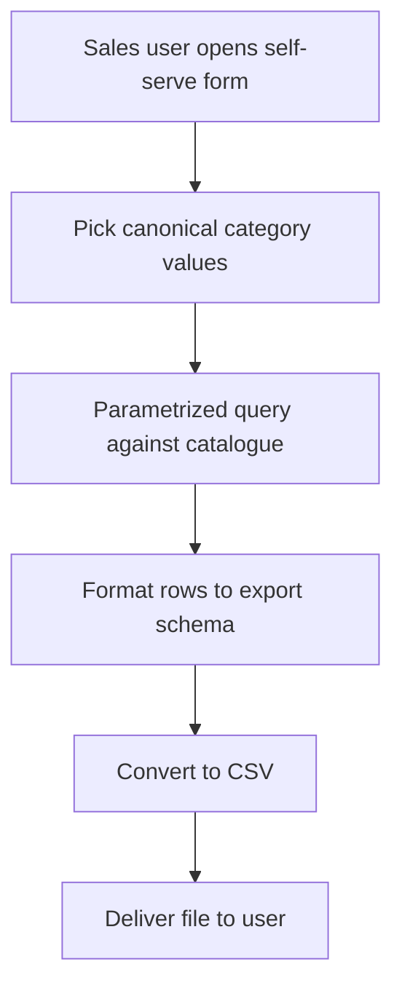
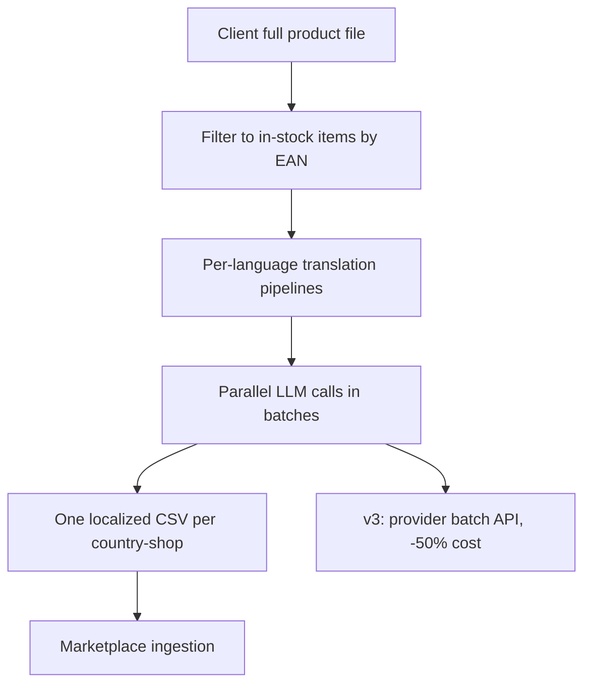
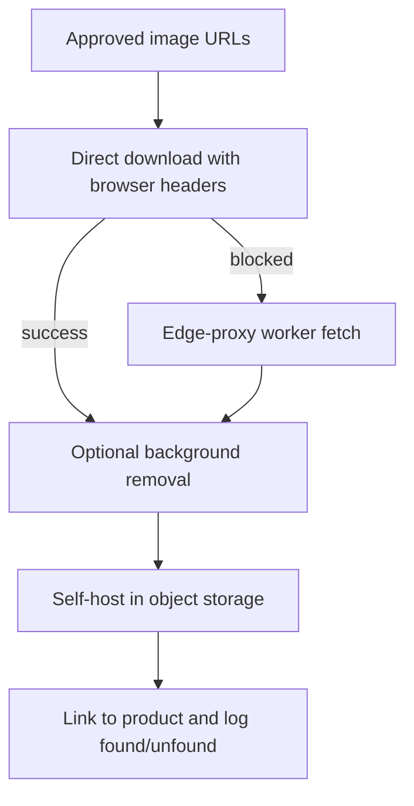
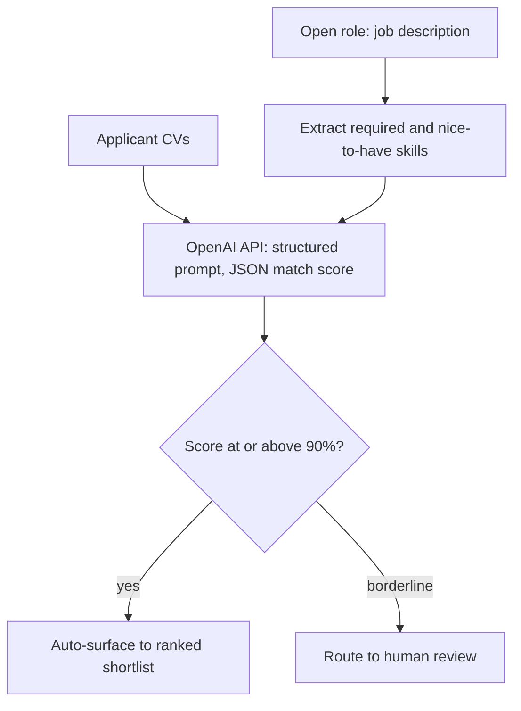
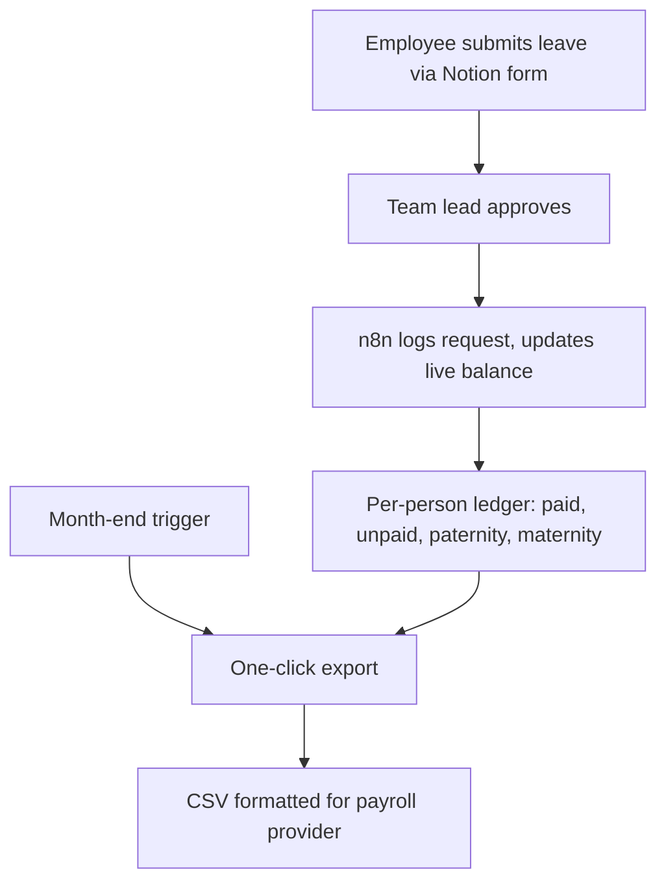
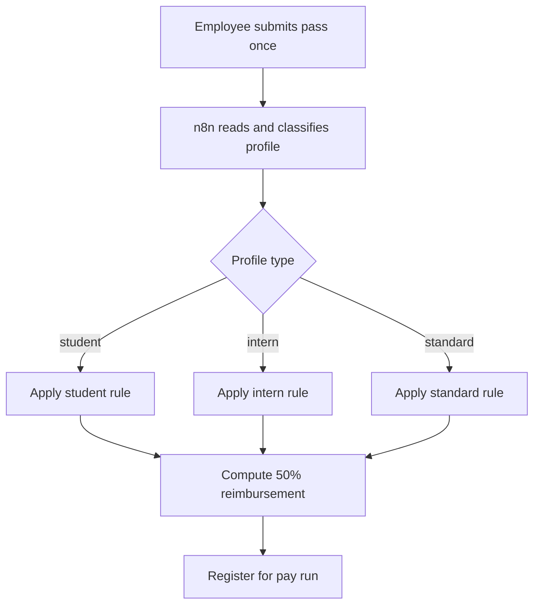
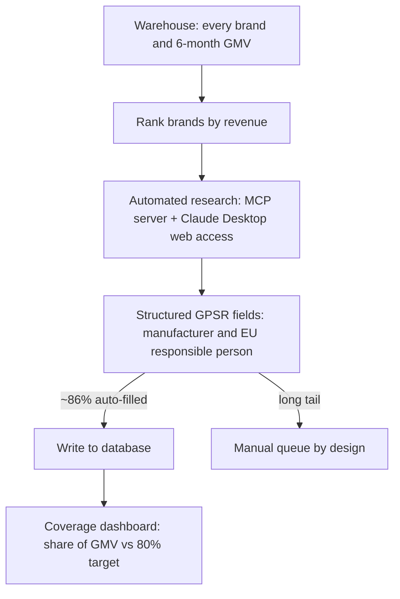

# Riddhiman Roy — Automation & AI Systems

I find the costliest manual work buried inside messy operational systems and turn it into automation that runs itself. n8n, LLM pipelines, SQL, prompt to production. Everything here was built and shipped at a European B2B e-commerce marketplace operating across 100+ retail platforms.

> Confidentiality: my employer and its partners are anonymized, architecture is described at the pattern level, and no internal systems are named. All quantitative figures are real. The workflow files are sanitized illustrations, not drop-in imports.

---

## Live demos

Three interactive tools, each running on synthetic data in the browser with no backend. Open and click around.

| Tool | What it shows |
| --- | --- |
| [**Shortlist** — AI CV screening](https://riddhimanroy1998-byte.github.io/portfolio/cv-screener.html) | Parses a role's requirements, scores every applicant with a weighted model, gates at a 90% confidence bar, returns a ranked shortlist |
| [**Coverage** — GMV-weighted compliance](https://riddhimanroy1998-byte.github.io/portfolio/coverage.html) | Ranks brands by revenue so filling the few that matter clears 80% of exposure fast (modeled on EU GPSR) |
| [**HR automations** — process & architecture](https://riddhimanroy1998-byte.github.io/portfolio/hr-workflows.html) | Leave and payroll preparation plus transit-pass reimbursement, as case studies with flow diagrams |

---

## How I build

A few principles that show up in every project below.

1. Kill the work, do not process it. When a request keeps landing in the queue, I build the source of the request out of existence rather than handling it faster.
2. Match the infrastructure to the task. The same translation job moved from a single LLM call to parallel pipelines to a batch API once I saw the workload was async-tolerant, for a flat 50% cost cut on identical output.
3. Ship v1, then harden with observability. I log found and unfound, pass and fail, from day one, because that is what makes the real failure mode visible later.
4. Confidence-gate the AI. High-confidence outputs auto-pass, borderline cases route to a human. A probabilistic tool should never auto-publish into a near-zero-tolerance step.

---

## Projects

| # | Project | What it proves | Links |
| --- | --- | --- | --- |
| 1 | Catalogue taxonomy standardization | Designing the data foundation a million products depend on | [code](catalogue-creation-automatic-addition_sanitized.json) |
| 2 | Self-serve export tool | Removing a recurring cross-team bottleneck at the input layer | [code](demander-export-self-serve_sanitized.json) |
| 3 | Multilingual product-page generation | LLM pipelines at catalogue scale, iterated for cost | [code](demand-generation-demander-csv_sanitized.json) |
| 4 | Image-ingestion pipeline | Resilient design with a two-tier fallback | — |
| 5 | CV screening and shortlisting | AI-native recruiting tool, prompt to production | [live demo](https://riddhimanroy1998-byte.github.io/portfolio/cv-screener.html) |
| 6 | Leave and payroll automation | People-ops admin reduced to one click | [live demo](https://riddhimanroy1998-byte.github.io/portfolio/hr-workflows.html) |
| 7 | Transit-pass reimbursement | Per-profile statutory logic, half a day to zero | [live demo](https://riddhimanroy1998-byte.github.io/portfolio/hr-workflows.html) |
| 8 | GMV-weighted GPSR prioritization | Using revenue weighting to make a regulation tractable | [live demo](https://riddhimanroy1998-byte.github.io/portfolio/coverage.html) |

Detailed write-ups with CV bullet points are in [`case-studies/portfolio-case-studies.md`](portfolio-case-studies.md).

---

### Data & catalogue pipelines

#### 1. Catalogue taxonomy standardization

A roughly 1M-product catalogue had grown with no consistent classification: mixed languages, no hierarchy, no canonical list. That broke querying, enrichment, and any mapping onto partner marketplaces, and the work had sat unowned in the backlog. I studied how major retail marketplaces classify products, designed a canonical three-level taxonomy, and modeled the whole hierarchy as a single self-referencing reference table. LLM-driven n8n workflows then backfilled the existing million products and normalize every new one on ingestion. The catalogue reached 100% standardization on levels 1 and 2 and 95 to 96% on level 3, and the taxonomy still governs catalogue creation today.

The judgment was in the iteration: testing a category as top-level then correctly demoting it, and pacing the million-product rollout over weeks to control token cost and workflow stability.

Stack: n8n, PostgreSQL (self-referencing schema, idempotent upserts), LLM standardization. Code sample: [`catalogue-creation-automatic-addition_sanitized.json`](catalogue-creation-automatic-addition_sanitized.json), the four-step idempotent insertion job.

#### 2. Self-serve export tool

The no-code team was a bottleneck for demander exports, the showcase product files the sales team sent to prospective partners. Each request meant a ticket, a roughly three-day queue, a fragile shared notebook, and manual category cleanup. I built a self-serve n8n form: the sales team picks from the catalogue's canonical category values, which removes category mismatch at the input layer, and the workflow queries the catalogue directly and returns a ready CSV. Turnaround fell from about three days to under 20 minutes, the ticket queue for this request type disappeared entirely, and it ran with zero maintenance after launch.

Stack: n8n (form trigger, parametrized Postgres queries, CSV delivery), PostgreSQL. Code sample: [`demander-export-self-serve_sanitized.json`](demander-export-self-serve_sanitized.json).

#### 3. Multilingual product-page generation

A large European marketplace client wanted its catalogue opened in five new country-shops, each needing product data in its own language. I built an n8n pipeline that filtered the client's full file to in-stock items by EAN, translated every field into all five languages with an LLM, and auto-generated one localized CSV per shop. The first single-LLM version hallucinated, so I re-architected it into dedicated per-language pipelines running parallel batched calls. Months later I moved the translation step onto the provider's batch API, same output, for a flat 50% token-cost cut. Five country-shops went live within about five days of starting.

Three deliberate iterations: single LLM, then per-language parallel pipelines, then batch API once I recognized the workload was async-tolerant.

Stack: n8n, LLM API (GPT-4o-mini) and its batch API, EAN filtering, CSV ingestion. Related code sample: [`demand-generation-demander-csv_sanitized.json`](demand-generation-demander-csv_sanitized.json), the scheduled incremental per-demander CSV builder that pushes generated rows downstream.

#### 4. Image-ingestion pipeline

After sourcing produced verified image URLs, there was no fast, safe way to get images into the system and onto the right product. I built an n8n workflow that downloads each image, optionally removes the background via an image API, self-hosts it in object storage, links it to the product, and logs every image as found or unfound so runs are trackable and re-runnable. That observability surfaced a failure mode: a meaningful share of downloads were blocked even with spoofed headers. I designed a two-tier fallback that reroutes blocked fetches through an edge-proxy worker, taking the tool from frequently blocked to reliably capturing images. It is still in production.

I built the observability in from v1, which is what made the failure visible, then scoped the edge worker for a teammate while owning the architecture and integration.

Stack: n8n, object storage (S3), background-removal API, Cloudflare Workers (edge proxy).

---

### People & HR systems

#### 5. CV screening and shortlisting → [live demo](https://riddhimanroy1998-byte.github.io/portfolio/cv-screener.html)

A three-person People team screened inbound CVs by hand, around ten an hour, which capped how many applicants got a fair read. I built an n8n workflow that extracts each role's requirements, scores every applicant with a structured OpenAI API prompt returning a JSON match score, gates at 90%, and surfaces a ranked shortlist. High-confidence matches auto-surface; borderline cases route to a human. Screening went from about ten CVs an hour to hundreds of applications ranked automatically each day across open roles.

Stack: n8n, OpenAI API (structured JSON output), confidence gating.

#### 6. Leave and payroll automation → [live demo](https://riddhimanroy1998-byte.github.io/portfolio/hr-workflows.html)

Every leave request was logged by hand, and at month end the team recalculated each person's days taken, entitlement, and remaining balance, across 80 employees and several leave types. I built an approval-triggered system: a Notion form routes to the team lead, and on approval an n8n workflow logs it and updates a live per-person balance across paid, unpaid, paternity, and maternity leave. At month end, one action compiles every balance into a single CSV formatted for the payroll provider.

#### 7. Transit-pass reimbursement → [live demo](https://riddhimanroy1998-byte.github.io/portfolio/hr-workflows.html)

French employers reimburse 50% of an employee's public-transit pass. Each month the three-person team blocked half a day to open every pass and compute the payout by hand, and the rules differ by profile (student, intern, standard). I built a form where each employee submits their pass once; an n8n workflow reads it, applies the right rule for that profile, computes the reimbursement, and registers it for the pay run. The recurring half-day dropped to zero.

---

### Compliance & influence

#### 8. GMV-weighted GPSR prioritization → [live demo](https://riddhimanroy1998-byte.github.io/portfolio/coverage.html)

When the EU's General Product Safety Regulation became enforceable, marketplaces began blocking listings that lacked full manufacturer and EU-responsible-person data, and coverage was patchy and maintained by hand. Working through thousands of brands alphabetically would waste effort on tiny ones, so I ranked every brand by trailing six-month GMV and worked top-down: cover the brands that carry 80% of revenue and you unblock almost all sellable business while touching a fraction of the catalogue. An automated research step filled most brands; the long tail stayed manual by design. A live dashboard tracked coverage against the 80% target. Manual research dropped from about three hours a week to roughly five minutes, at an automated hit rate near 86%.

Stack: n8n, MCP server, Claude Desktop (web research), Snowflake, Metabase, SQL.

---

## Code samples

Sanitized, genericized n8n workflows are the three .json files in this repo. Credentials, internal hostnames, schema and table names, and client identifiers are removed or replaced with placeholders. The control flow and SQL and JS logic are faithful to the original; the names are not. These are illustrations, not drop-in imports.

- [`demander-export-self-serve_sanitized.json`](demander-export-self-serve_sanitized.json) — form to taxonomy-constrained query to CSV export.
- [`demand-generation-demander-csv_sanitized.json`](demand-generation-demander-csv_sanitized.json) — scheduled, incremental per-demander CSV builder.
- [`catalogue-creation-automatic-addition_sanitized.json`](catalogue-creation-automatic-addition_sanitized.json) — four-step idempotent catalogue insertion.

---

## Contact

Riddhiman Roy · Paris, France · riddhimanroy1998@gmail.com

CV available on request.
