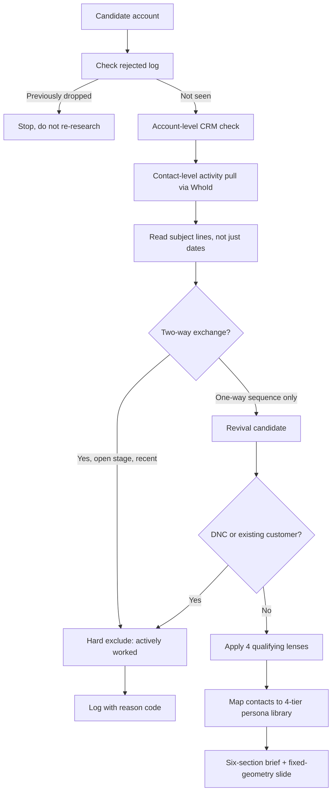
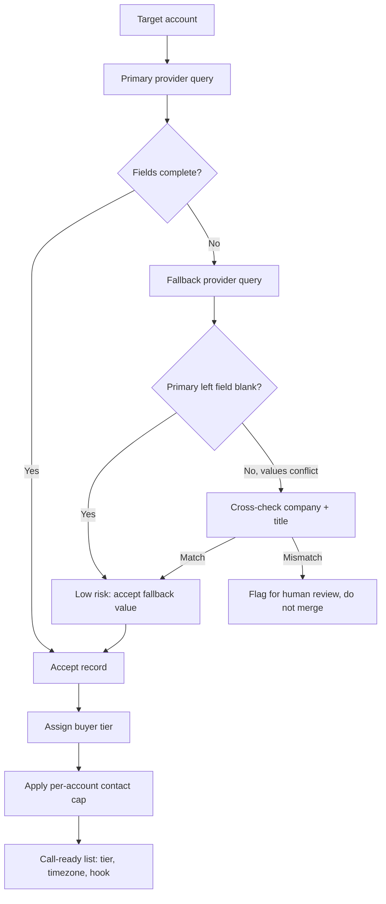
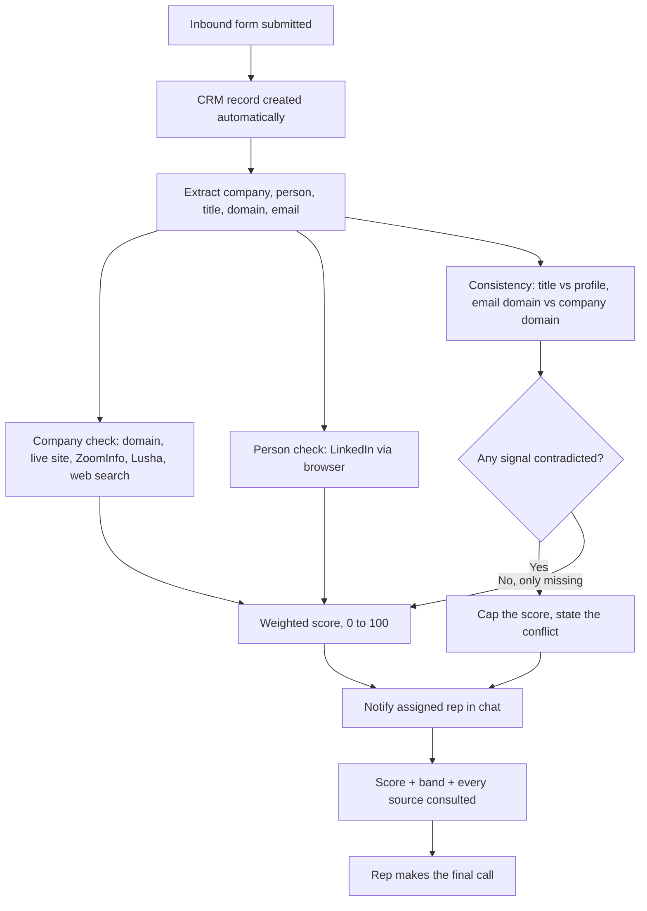

# GTM Engineering — Case Studies

Built at a cybersecurity SaaS vendor (digital risk protection / external attack surface
management), selling into security leadership at enterprise accounts.

Architecture and method are described at the pattern level. Employer-internal field names,
CRM schema, account names and colleague names are withheld. Outcome metrics live on my CV
rather than here; these write-ups are about how the systems were reasoned about and built.

---

## 1. Auditing an Account Qualification Process Instead of Running It

### Context

The sales team ran a top-tier prospect classification: a small set of enterprise accounts,
each with a named SDR owner, capped at a handful of active accounts per rep at any time. The
cap is what makes the classification work and also what makes it expensive. Putting the wrong
company on that list consumes one of very few slots for a quarter.

I was handed the existing qualification method and a patch to apply it to: one region, 13
industries. The straightforward move was to execute it. I checked whether it worked first.

### The problem, traced to root cause

Two failures, and both pushed in the same direction: discarding good accounts while letting
already-worked ones through.

**Failure 1: the exclusion rule was too strict, and it was biasing the output by sector.**

Any prior touch in the CRM disqualified an account. That sounds conservative until you notice
which sectors have the longest sales history and therefore the most residual contacts:
finance, insurance, telecommunications, software. The rule was eliminating most of them. What
survived skewed heavily toward a couple of industrial verticals, and not because anyone had
decided those were the priority. It was an artefact of the filter, and it was invisible from
inside normal use because the output still looked like a plausible longlist.

**Failure 2: the CRM query could not see the thing it was being used to detect.**

One account read as entirely untouched. Zero opportunities, zero account-level activity. It
cleared for outreach. A deeper check found three automated outbound emails sent to its
contacts five months earlier, by a different rep than the account owner.

The cause is a Salesforce data-model behaviour, not a data-entry mistake. Activity logged
against a *contact* is stored with the contact in `WhoId`. A query scoped to the *account*
reads `WhatId`. Contact-level activity therefore never appears in an account-level check, and
the check returns zero even when real outreach happened. Every account the team screened went
through that query, so every screen was capable of the same false negative.

That is the part worth generalising: the team was not screening carelessly. They were
screening correctly against a field that structurally could not answer the question.

### What I built

**A reframed exclusion rule.** A dormant touchpoint stopped being grounds for rejection and
became a reason to look harder. An account that already knows the company, with a named prior
contact, is frequently a better target than a cold one. Only three conditions now
hard-exclude:

1. An explicit do-not-contact on file
2. Genuinely active prospecting, meaning recent activity **and** an open stage **and** a real
   two-way exchange, all three
3. An existing customer

Everything else stays in play, with a flag where it needs one.

**A verification step that reads content, not dates.** The contact-level pull
(`WhoId IN (SELECT Id FROM Contact WHERE AccountId = …)`) is only half the fix. The other
half is reading each subject line rather than trusting recency, because the distinction that
decides the outcome is a real two-way exchange versus a one-way automated sequence. Recency
cannot tell those apart. "Actively prospected, hands off" and "revival candidate, go" can sit
on identical timestamps.

**A standing brief, produced unprompted for every candidate.** Six fixed sections: the
profile, why this account beat the others screened alongside it, live web-sourced hooks with
fresh explicitly flagged against stale, CRM existence and ownership in both systems, exactly
which contacts were previously touched and what was sent, and the target contact lists.
Produced for every candidate rather than on request, so the reasoning is auditable by someone
who wasn't in the session.

**A four-tier persona architecture.** Tiered by buying role rather than seniority, which
matters because generic C-suite titles turn out to be weak targets and get demoted to
fallback only. Two decisions did most of the work. Generic IT titles are restricted to
OT-heavy verticals, because everywhere else they pull irrelevant contacts. And titles that
collide across sectors get disambiguated explicitly: in finance, "CIO" means Chief Investment
Officer about as often as Chief Information Officer, and treating those as the same person
produces nonsense outreach. A warm-path tier sits one rung below the buyer for connect-first
sequences.

**A rejected log with fixed reason codes.** Every screened-and-dropped company recorded with
a date and one of six reasons, checked before any new candidate is proposed. The point is that
nothing gets researched twice, across sessions or across people.

**A fixed output specification.** Seven boxes, fixed geometry, hard character limits per box.
Content gets cut to fit; type size and column widths never move. Every rep's output is
identical in shape, which is what makes it forwardable without a second look.

**Packaged as a reusable skill**, seven steps against four qualifying lenses, including a
regulatory lens and a live exposure-signal lens. Account sizing was recalibrated to a defined
sweet spot above a floor, deprioritising mega-caps where the lead pool is large but
practically unworkable.

**Contributed back upstream.** The fixes were written as drop-in edits and handed to the owner
of the team-wide version, including the `WhoId` fix, so they reach every region instead of
staying on my patch.

### The design decision underneath all of it

The rule set is built around an asymmetric cost. With very few slots per rep, a false
positive burns a quarter and a false negative quietly loses a good account. Those are not
equally bad, and they are not equally reversible. So the design is deliberately lopsided:
three narrow hard-excludes, and everything else stays in play carrying a flag. The flag is
cheap. The slot is not.

The second decision is that every piece of this is built to survive the person who made it.
The rejected log, the fixed brief format, the character-limited output spec and the upstream
patch all exist so the improvements outlast any single session or rep.

### What transfers

The reusable part is not the account list. It is the habit of checking whether a process you
were handed can actually detect what it claims to detect. Both failures here were invisible
from inside correct usage. The filter produced a believable longlist and the query returned a
clean zero. Neither looked broken, and that is exactly why nobody had caught them.

The data-integrity instinct generalises well past sales: a query scoped to the wrong object
returns a confident, well-formatted, wrong answer, and nothing in the output tells you so.

---

## 2. A Two-Source Enrichment Waterfall That Refuses to Guess

### Context

Outbound at an enterprise vendor runs on contact data: a name, a title, a direct line, a
current employer. The data comes from commercial providers, and no provider is complete. Any
given account will have contacts one vendor knows and another does not.

The team's working practice was to pull from one provider at a time. When a second provider
was consulted because the first came up short, there was no rule for what to do if the two
disagreed.

### The problem, traced to root cause

The symptom looks like a coverage problem: not enough contacts. It is actually a trust problem.

Two providers can return the same person with a different phone number, a different job title,
or a different current employer. One of those records is stale. Nothing in either record tells
you which. Absent a rule, the practical default is to take whichever field is populated, which
silently prefers *available* data over *correct* data.

The failure mode that follows is not an empty list. It is a confident one. A rep dials a
number that belonged to someone two employers ago, or opens with a title the person no longer
holds. The list looks complete, the call fails for a reason the rep cannot see, and the data
gets blamed on nothing in particular.

Worth separating the two things a fallback can disagree about:

- **A field the primary left blank.** Low risk. There is nothing to contradict.
- **A field the primary already filled, differently.** High risk, and it is the case that
  naive merging handles worst, because a populated-field conflict is evidence that at least one
  source is wrong about this person.

### What I built

**An explicit primary and fallback, not a blend.** One provider is the source of record. The
second is consulted only where the first comes up short. This ordering is the whole design:
a blend has no tiebreaker, a waterfall does.

**A cross-check protocol before any fallback field is trusted.** A fallback-sourced phone
number is not accepted on its own. The company and the job title on the fallback record have
to match the primary record first. If they do not, the person in front of you may not be the
person the primary knows, and the number is not usable. Conflicting phone, company or title
data is never silently merged. It is flagged and left to a human.

The reasoning: a phone number cannot be validated on its own terms. You can only validate it
by checking the identity attached to it. So the cheap fields become the guardrail on the
expensive one.

**Tiered buyer profiling.** Three core tiers by buying role — decision-maker, influencer,
contributor — plus a vertical-specific tier for deal-team and M&A buyers, who behave
differently enough to need separate handling. Role, not seniority, because seniority is a poor
predictor of who actually moves a security purchase.

**A taxonomy mapping across both providers.** Thirteen target industries, mapped across two
different vendor taxonomies, because the same industry is not labelled the same way in both.
Without the mapping, a fallback query silently returns a different population than the primary
one did, and the waterfall quietly stops comparing like with like.

**A hard cap on contacts per account.** A small number per account rather than pulling
everything available. The constraint is deliberate: a capped list forces a decision about who
matters, and an uncapped one defers that decision to the rep at dial time, when they have the
least context and the least time.

**Call-ready output, not a contact table.** Company, contact, title, tier, timezone, direct
line, and a one-line context hook to open on. The timezone and the hook are the two fields
that make the difference between a list you have to prepare from and a list you can work
directly.

### What transfers

This is a record-linkage problem wearing sales clothing. The general shape shows up anywhere
two imperfect sources describe the same entity: you cannot resolve a conflict by looking
harder at the conflicting field, so you resolve it by checking a different field that is
cheaper to verify and harder to get wrong.

The other transferable piece is refusing to merge. A pipeline that flags and stops is more
useful than one that produces a complete-looking output with unknown error inside it, because
the second kind cannot be debugged from its own output.

---

## 3. Eight Agents Against One Stack

### Context

An SDR's week is mostly not selling. It is research, CRM hygiene, write-ups, and moving
information between systems that do not talk to each other: a CRM, a second CRM, email, chat,
a document store, a prospecting tool.

The usual response is a longer checklist. I built tooling against the stack instead.

### The design rule

Each agent replaces one specific recurring task, and each one is grounded in a source the team
already trusts rather than in the model's own knowledge. That second constraint is what makes
them usable: an account briefing invented by a model is worse than no briefing, because
someone will act on it.

So every agent reads from somewhere real. The battlecard builder is grounded in internal
content and CRM win/loss history. The outreach generator is grounded in the rep's own sent
mail. The account summary is grounded in CRM records plus marketing engagement plus live web
signals. None of them answer from memory.

### What the suite covers

- **Account sourcing**, qualifying new target accounts against defined ICP lenses. Covered in
  case study 1 above.
- **An outreach generator** that reads a rep's own sent-mail history to learn their voice
  before drafting cold email and LinkedIn messages for a named prospect. The point is that a
  rep will not send something that does not sound like them, so matching voice is a
  precondition for adoption rather than a nice finish.
- **A call-notes formatter** converting raw SDR notes into a standardised AE qualification
  brief. This one is a handoff-quality problem: the AE needs fixed fields in a fixed order,
  and the SDR writes in fragments during a live call. The agent sits between those two formats.
- **An account summary** pulling CRM records, marketing engagement and web and news signals
  into one briefing, so a rep stops assembling context from four tabs.
- **A competitive battlecard builder** grounded in internal positioning content and CRM
  win/loss history, in a category crowded enough that a rep meets a named competitor on most
  calls.
- **A CRM sync** from the prospecting tool, deduping against existing records **by verified
  domain** before creating anything. Domain rather than company name, because company name is
  free text and will cheerfully create a second record for the same company under a different
  spelling. This is the same data-integrity instinct as case study 2, applied at write time
  instead of read time.
- **An inbound triage agent**, routing new inbound through a scored confidence check before it
  reaches a rep, with the rep making the final call. Covered in case study 4 below.

### What transfers

The pattern worth taking is grounding over generation. Each of these could have been a prompt
that asks a model what it knows about a company. None of them are. They retrieve from a
trusted source and then format, which makes the output checkable, and checkable output is the
only kind a sales team will actually keep using after week two.

The second pattern is that the hardest part of each agent was not the model. It was deciding
which existing artefact counted as ground truth, and in two cases (verified domain, the rep's
own sent mail) that decision is the entire design.

---

## 4. Scoring an Inbound Before a Human Spends Time on It

### Context

Inbound arrives and a CRM record is created automatically. The record carries whatever the
person typed: a name, a job title, a company, and sometimes a company domain or a work email.

That is a form submission, not a qualified lead. Everything on it is self-asserted. The company
may not exist, the title may be inflated, the person may not work there, and the whole thing may
be a competitor, a student, or a bot. None of that is visible from the record itself, and all of
it is expensive to find out, because the only way to check is to go and look.

So the real cost of inbound is not the bad ones. It is that a rep cannot tell which are bad
without doing the work, and the work is identical whether the lead turns out to be real or not.

### The problem, stated precisely

Three different things get collapsed into "is this lead good":

1. **Does the company exist?** Answerable from a domain and a commercial database.
2. **Does this person work there?** Answerable from LinkedIn.
3. **Does what they claimed match what is verifiable?** A different question again, and the one
   that actually separates a real buyer from a plausible-looking form fill.

A rep checking manually answers all three at once, in their head, and arrives at a yes or no
with no record of why. The next rep facing the same account starts over.

### What I built

An agent that runs the three checks against named sources and returns a score with its working
shown, then hands the decision to the assigned rep over chat. It does not decide. It removes the
part of deciding that is lookup.

**The checks:**

- **Company existence.** Extract the company from the CRM record, resolve a domain, confirm a
  live website, and look for the company in the commercial data providers already in the stack
  (ZoomInfo, Lusha), plus a general web search for anything the databases miss.
- **Person existence.** Find the person on LinkedIn at that company, via Claude driving a browser
  rather than a scraping endpoint.
- **Claim consistency.** Compare the stated job title against the one on the profile, and the
  email domain against the company's own domain.

### The scoring model

Three evidence groups, weighted by how much each one tells you:

| Group | Weight | What earns it |
| --- | --- | --- |
| Company is real | 40 | Domain resolves to a live site (20), company present in a commercial provider (15), corroborated by both providers (5) |
| Person is real and is there | 35 | Profile found at the named company (25), profile substantive rather than a shell (10) |
| Claims match evidence | 25 | Stated title matches the profile (15), email domain matches company domain (10) |

**The design decision that matters: absence and contradiction are not the same thing.**

A missing signal is weak evidence. No LinkedIn profile might mean a private profile, a
non-English name spelled differently, or someone who genuinely does not use it. That should cost
points and nothing more.

A *contradicted* signal is strong evidence, and it points the other way. If the profile says the
person works somewhere else, or the email domain belongs to a different company entirely, that is
not a gap in the evidence. It is evidence. So a contradiction **caps** the total regardless of
what else scored well, rather than being averaged away by a strong company check. A real company
plus a person who does not work there is a worse lead than an unknown company, and a model that
simply adds up points will rank it higher. That is the specific failure this guards against.

**Bands:**

- **80 and above.** Everything checks out. Routed to the assigned rep as verified.
- **50 to 79.** Something is missing, not contradicted. Routed with the specific gap named, so
  the rep spends their time on the one open question instead of re-checking everything.
- **Below 50, or any contradiction.** Routed with the conflict stated explicitly.

**Nothing is auto-rejected.** Every inbound reaches its assigned rep through a chat notification
carrying the score, the band, and every source consulted. The score orders attention; it does not
gate access. A probabilistic check should never silently discard a lead, because the cost of
being wrong is asymmetric: a wasted twenty minutes against a lost deal.

**Every score ships with its sources.** A bare 72 is useless, because the rep cannot tell whether
it means a solid company with an unverifiable person, or a shaky company with a confirmed one.
Those two call for opposite next actions. Showing the working is what makes the number
actionable rather than decorative.

### What transfers

The reusable idea is separating *missing* from *contradicted*. Most scoring systems treat both as
"low confidence" and average them into the total, which quietly ranks an actively suspicious
record above a merely unknown one. Splitting them changes what the number means and what a human
should do about it.

The second is that the agent's job ends one step before the decision. It does the lookup, shows
the sources, and stops. That boundary is what makes it something a team will keep using, because
nobody has to trust it to benefit from it.

---
