# Pipeline deep dives

Three production pipelines I built at a European B2B e-commerce marketplace operating across 100+ retail platforms. These are the deeper, per-workflow companions to the shorter case studies elsewhere in this repo. The focus here is on how each system is built and why, with a diagram for every logical stage.

> Confidentiality: my employer and its partners are anonymized, architecture is described at the pattern level, and no internal hostnames, schemas, table or column names are used. Quantitative figures are real; where a stage was never measured, impact is described by mechanism instead.

A note on two recurring terms. A **demander** is a buy-side customer, a retailer or marketplace that wants to list products; the company publishes product pages onto these demander marketplaces on the customer's behalf. Products are identified by a **matching key**: for most goods this is an EAN barcode, but where a product ships in many sizes (footwear, apparel) the product is keyed by its manufacturer part number (MPN) and each size becomes a **variant** carrying its own EAN. So one shoe model is a single product with several variant rows.

---

# Product-page generation for demander marketplaces

This pipeline takes a product from the internal catalogue and produces a complete, marketplace-ready listing for a specific demander: the right category on that marketplace, images processed to that marketplace's visual spec, and every required attribute filled in by LLM at both the product and the variant level. The output is a per-demander CSV or XML feed. It runs continuously, picking up new products as they enter the queue.

The design principle throughout is **constrain the model, then trust it**. Every LLM step is handed a closed list to choose from or an explicit attribute spec to fill, and is told never to invent. The pipeline narrows the problem with cheap SQL before spending tokens, and guards every write so a product is never built twice.

## Overview

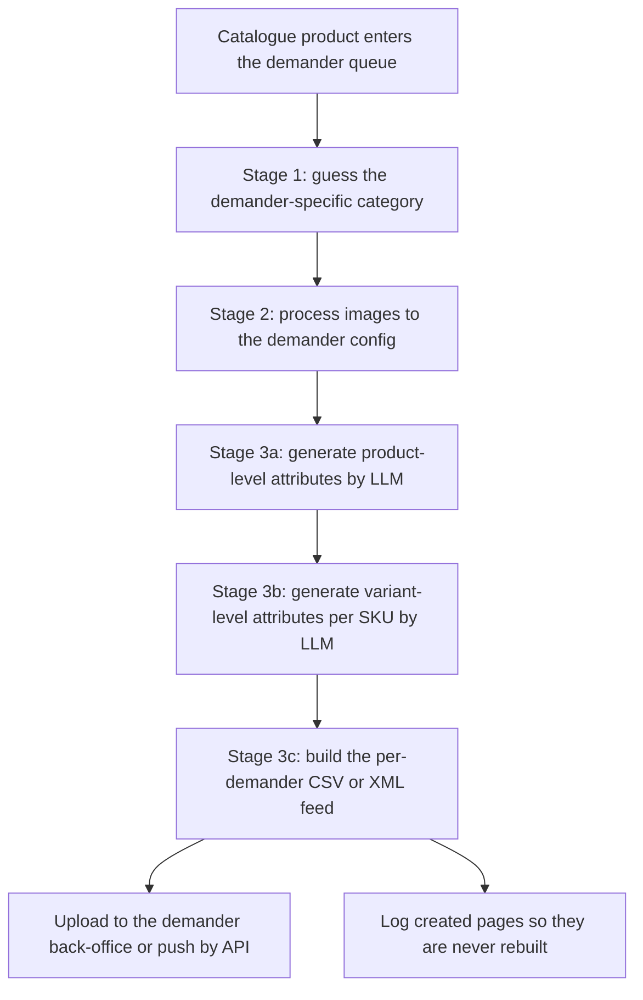

## Stage 1: category guessing

Each demander has its own category taxonomy, so before any attribute can be generated the product has to be mapped to the correct category on that specific marketplace. Doing this in one LLM call against a large taxonomy is both expensive and error-prone, so I split it into a two-stage cascade. First the model picks exactly one top-level category from the demander's level-1 list. That choice filters the full taxonomy down to one branch, and only then does a second call pick the best leaf category from the much smaller candidate set, or return NA if nothing fits. The model must select from the supplied list and is not allowed to invent a value, which removes the main failure mode of LLM categorisation. The matched leaf id is the key that unlocks everything downstream: it determines which attributes are required, which image config applies, and which authorized value lists are in play.

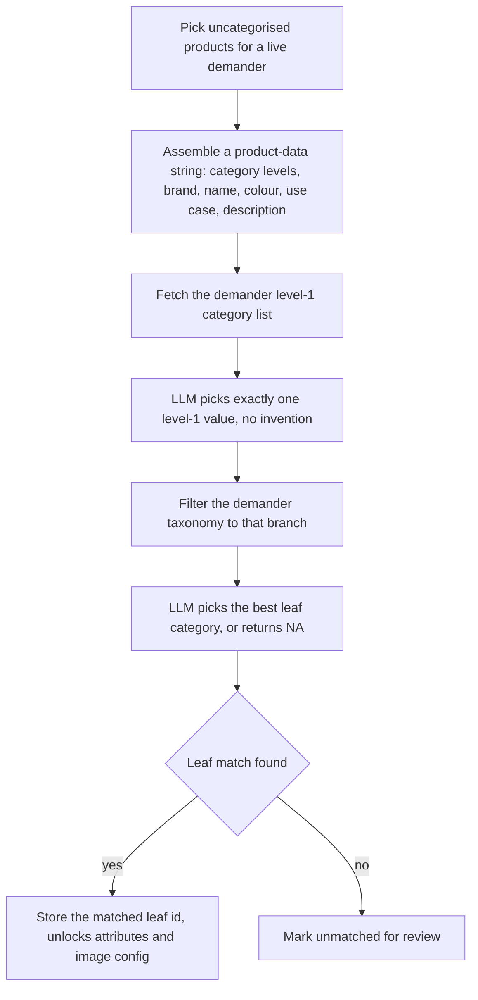

## Stage 2: image processing

Every demander wants images in its own format: dimensions, background colour, margins, positioning. This stage is two cooperating workflows. A registration pass runs every 15 minutes and, for each product with no image-log entry, walks the category chain to resolve the desired config, then checks what the product already has. If the right config is present it is marked done immediately; if the product has no images at all it is routed to the catalogue's image-sourcing queue instead. A processing pass runs every 4 minutes, classifies each pending row by which stages are already complete, and sends it down the right path: background removal through Photoroom for raw images, then versioning to apply the demander's exact spec. Both outputs are self-hosted in S3 under a deterministic naming convention so the downstream attribute step can reconstruct every image URL without a lookup.

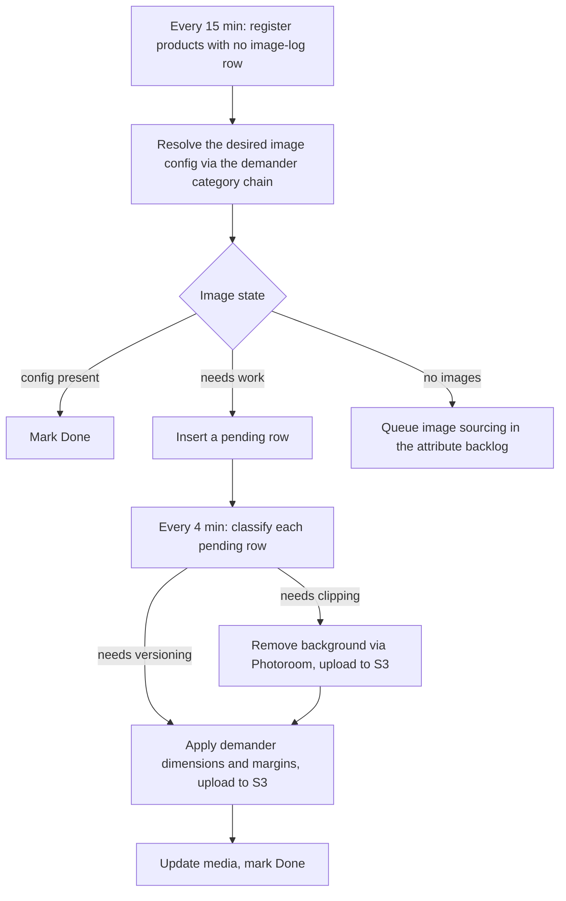

## Stage 3a: product-level attribute generation

Once a product is categorised and its images are processed, this stage fills every product-level attribute the demander requires for that category. The coordinator runs every minute, pulls a priority-ordered batch, and dispatches each product to a sub-workflow without waiting. The sub fetches the demander's attribute spec for the matched category, gathers all available product data (brand, MPN, name, colour, recommended price, description, model name, legal producer information), reconstructs the processed image URLs, and hands the model the data plus the full set of attribute definitions and filling rules. A single GPT-4.1-mini call at temperature 0.3 returns one structured JSON with every attribute filled to that demander's rules. A verification step then re-checks that all attributes marked required were actually produced, and any that are missing are flagged rather than silently shipped.

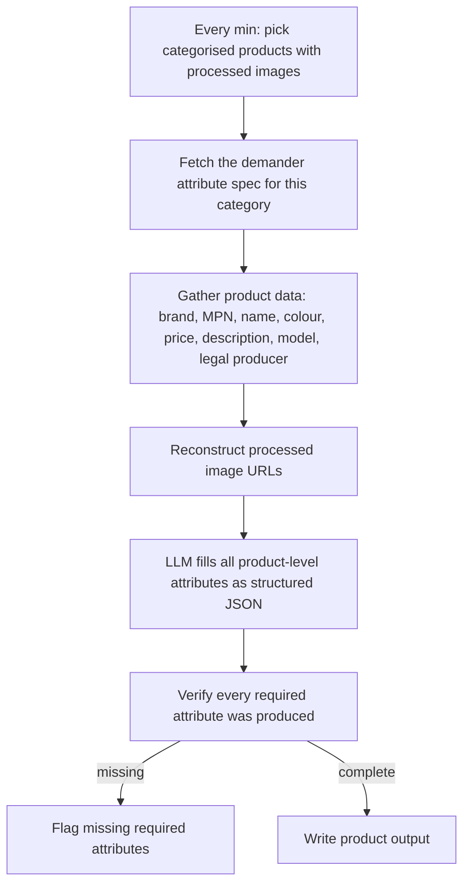

## Stage 3b: variant-level attribute generation

Product-level data is not enough: each size or colour variant needs its own attributes, mostly the size mapped onto the demander's own size taxonomy. This stage runs only on products whose product-level step fully succeeded, which keeps a half-built product from ever reaching a feed. The sub loads every variant for the product, then loops them in batches, generating variant attributes with GPT-4o-mini and merging the product output, the variant output, and the image URLs into one unified JSON per variant ready for export.

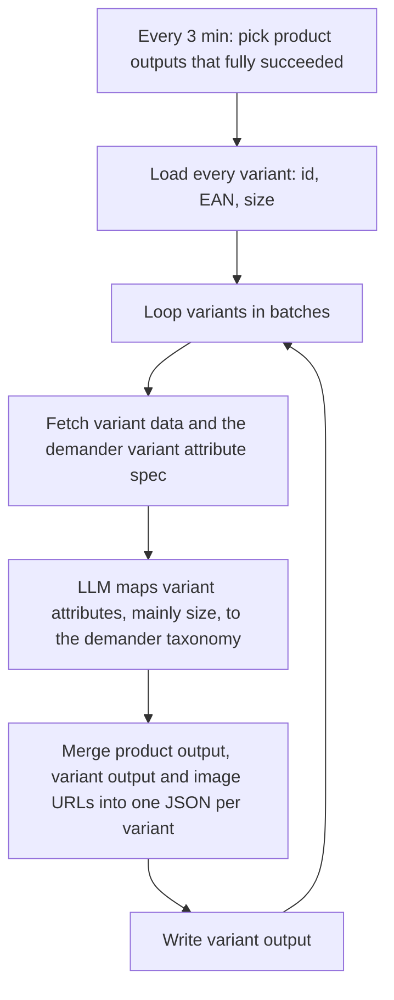

## Stage 3c: feed generation

The final stage compiles finished variants into the file the demander actually ingests. I left this step on a manual trigger on purpose: feed delivery is low-frequency and demander-specific, so fully automating it would have added fragility for no real saving, a deliberately scrappy v1 choice. The workflow selects only variants for the target demander that have not already been created, then branches on format: most demanders take a flat CSV with output prefixes stripped, one is filtered to a single brand before export, and one requires XML variations instead of a flat file. Files are uploaded to a dated folder in Google Drive. A separate, also-manual step logs every created page so the same product is never rebuilt into a future feed.

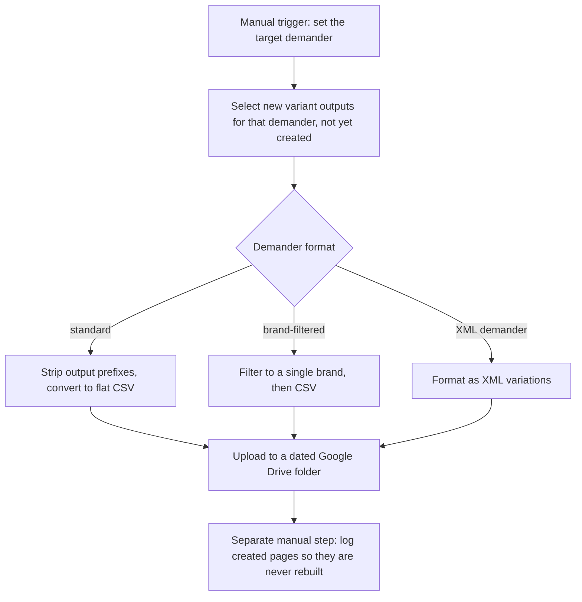

Stack: n8n, PostgreSQL, OpenAI API (GPT-4.1-mini and GPT-4o-mini, structured JSON output, temperature 0.3), Photoroom, S3, Google Drive.

---

# Catalogue creation

This is the continuous pipeline that builds and maintains the internal product and variant catalogue, a base of over 1M products with thousands more processed every day at the product level. It runs on two parallel tracks: sourcing new products from the marketplace data source, and enriching existing products with attributes, images, and standardised categories. The whole thing is built to be idempotent and self-healing: every write uses conflict handling so any workflow can be safely re-run, and a row that fails to process is simply re-picked on the next cycle rather than lost or retried forever.

The coordination spine is a two-stage backlog. Raw candidates land in an intake backlog, get cleaned and graded, and are promoted into a build backlog of brand-and-key pairs that have not yet become catalogue products. From there, extraction engines enrich them into a staging table, an insertion job promotes them into the live catalogue, and per-attribute queues automatically schedule whatever enrichment is still missing.

## Overview

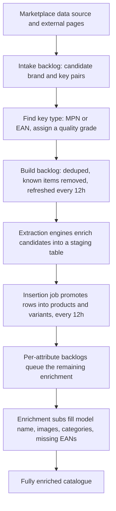

## Stage 1: backlog construction

This stage keeps the two-stage buffer between raw discovery and the catalogue clean. New brand-and-key pairs arrive into the intake backlog, where a key-typing step decides whether each key is an MPN or an EAN and assigns it a quality grade. The promotion job, on a 12-hour schedule, deduplicates the intake, drops anything that already exists in the catalogue or is already queued, drops rows with neither identifier, and promotes the survivors into the build backlog. It keys each entry to a graded MPN where one is available and trustworthy, otherwise to the EAN, and upserts so re-running only refreshes the source and the priority score. That priority score is where commercial logic lives: higher-value products are worked first rather than alphabetically.

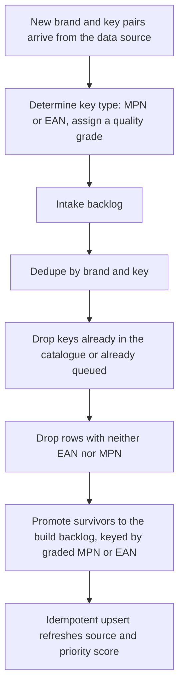

## Stage 2: catalogue insertion

The insertion job promotes enriched staging rows into the live catalogue in four sequenced SQL steps, each idempotent. Step one deduplicates by brand and key, inserts products while validating their categories against the canonical taxonomy, normalises brand and colour, and on conflict updates fields and merges attributes rather than overwriting. Step two handles variants: for EAN-keyed rows it creates variant entries, normalises sizes to a consistent notation, and updates each product's variant count. Step three is what makes the system self-feeding: for clothing and footwear products that arrived as MPNs and therefore have no variants yet, it queues a high-priority task to go find their EANs. Step four cleans both the build backlog and the staging table of everything that was inserted.

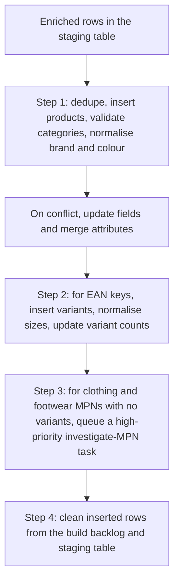

## Stage 3: extraction engines

These workflows are the data engines that turn a build-backlog entry into an enriched staging row. On a 30-minute schedule, a coordinator selects entries that are not yet built and have not previously failed, then dispatches batches to a sub. The sub resolves the data source: an MPN key first has to be resolved to its most common EAN, while an EAN key is used directly. With the EAN it locates the connected component, the cluster of marketplace items recognised as the same product, and pulls characteristics from every retailer selling it. An LLM then summarises that raw, multi-retailer data into structured JSON under a strict no-hallucination prompt: if a fact is not in the data, it does not appear. A scraping step pulls extra fields from the stored product-page URL, and a separate loop finds a reliable source URL when none is on file. Everything merges into one staging row.

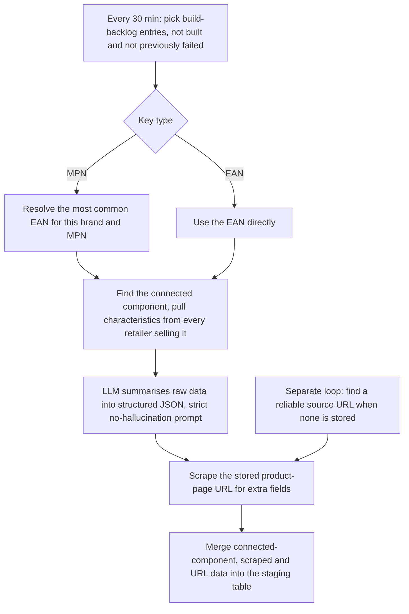

## Stage 4: attribute enrichment

After a product is in the catalogue, anything still missing is filled by a set of enrichment subs, each driven by its own priority-ordered queue. The most important is the investigate-MPN task queued during insertion: because variants need EANs, a product that arrived as an MPN has none, so this routes by category to a footwear or apparel sub that scrapes the brand or distributor page for the size-and-EAN matrix and inserts the discovered variants. Other queues derive missing model names, select graded images from the connected component and write them to the media table while logging every rejection with a reason, and standardise category labels to the canonical taxonomy. Category standardisation runs in two places, on the staging table before insertion and on already-inserted products, so labels stay clean at both gates.

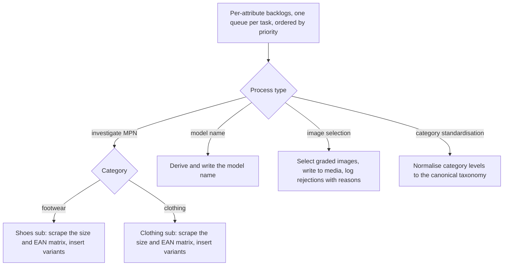

Stack: n8n, PostgreSQL (idempotent upserts, conflict handling, priority-scored queues), OpenAI API (GPT-4o-mini, structured JSON output), web scraping with browser headers, S3.

---

# Automated product-match verification

Internally this was the mismatch pipeline. A mismatch is when the item a supplier has listed is not the item the buyer ordered: a different model, colour, or size. When the company brokers a transaction, a buyer order line is matched to a product in a supplier catalogue, and this pipeline checks whether that match is real. It takes suspected mismatches, runs both items through LLM extraction and an attribute-by-attribute comparison, and writes a structured verdict, match or mismatch per attribute with reasoning, back to a staging table for downstream decisioning. It processes on the order of hundreds of suspected mismatches a day.

The interesting build decision is to never ask one model "are these the same product?" as a single blob judgment. Instead the comparison is decomposed into eight independent specialist comparisons, each with its own domain rules, run in parallel. That makes every verdict explainable and debuggable, and it lets each attribute carry its own true, false, or null result, so "we could not tell because the data was missing" is cleanly distinct from "these genuinely differ."

## Overview

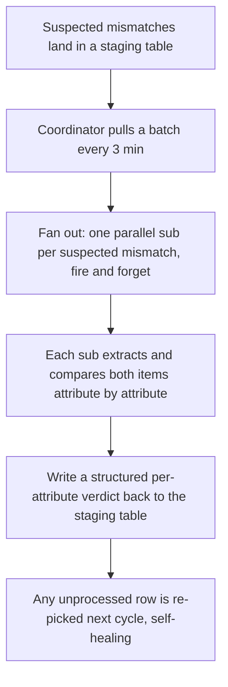

## Stage 1: queue coordinator

The coordinator is a pure queue-feeding loop on a 3-minute schedule. It selects up to 25 rows whose final reasoning column is still empty, which is the signal that a row has not yet been analysed, since that column is the last thing the sub writes. It dispatches each row to the comparison sub in parallel and, crucially, does not wait for any of them to finish. Firing and forgetting maximises throughput, and it is safe precisely because the queue is idempotent: if a sub crashes or times out, its row never gets a verdict written, so the very next cycle simply picks it up again. There is no retry bookkeeping to maintain.

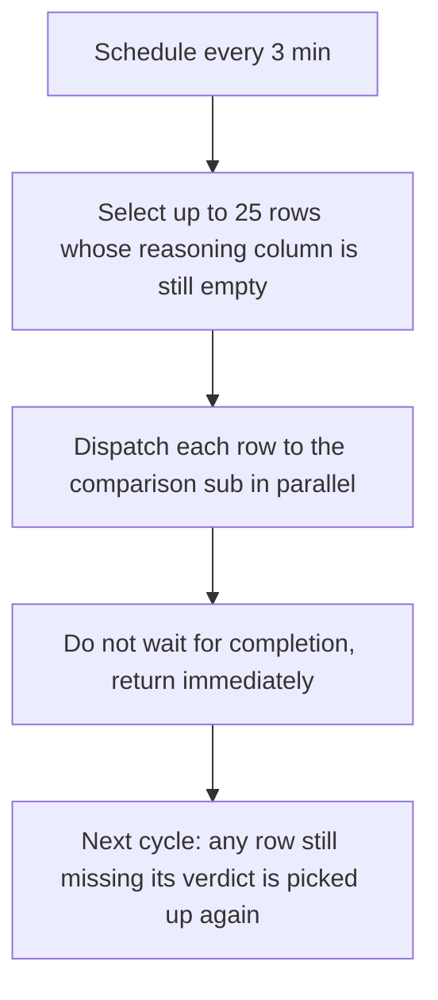

## Stage 2: the comparison engine

Each sub receives one suspected mismatch and runs under a 59-second timeout. It fetches the two items in parallel, runs two parallel LLM extractions to pull structured characteristics from each (brand, model, colour, category, size, description, quantity, package contents), with the standing instruction to output NA rather than invent anything. The merged characteristics then fan out to eight simultaneous comparisons, each a specialist: brand matching that accepts sub-brands and minor variations, colour matching that treats close shades as equal, model matching that ignores size, gender, and colour noise unless there is a clear contradiction, and so on. Each comparison returns its boolean verdict, the normalised values it compared, and a reasoning string of more than 100 characters, which forces the model to actually justify itself rather than emit a bare flag. The eight verdicts merge into one row written back to the staging table.

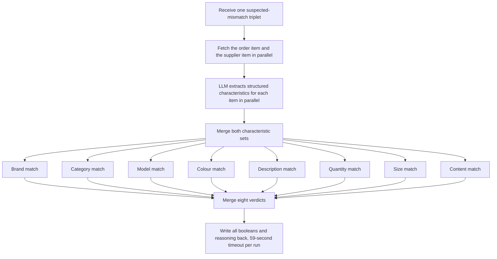

## QA variant

A parallel variant of the comparison sub carries identical logic but runs on a manual trigger and dual-writes its results to both PostgreSQL and a Google Sheet. That sheet is the human-inspection surface: it lets a person read the model's reasoning side by side with the verdicts and confirm the pipeline is behaving before trusting it at volume. Keeping a probabilistic component auditable like this, rather than letting it write silently into a decisioning step, is the same confidence-gating instinct that runs through the rest of my work.

Stack: n8n, PostgreSQL, OpenAI API (GPT-4o-mini, structured JSON output, parallel fan-out), Google Sheets (QA surface).
