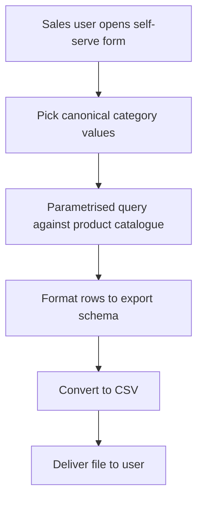
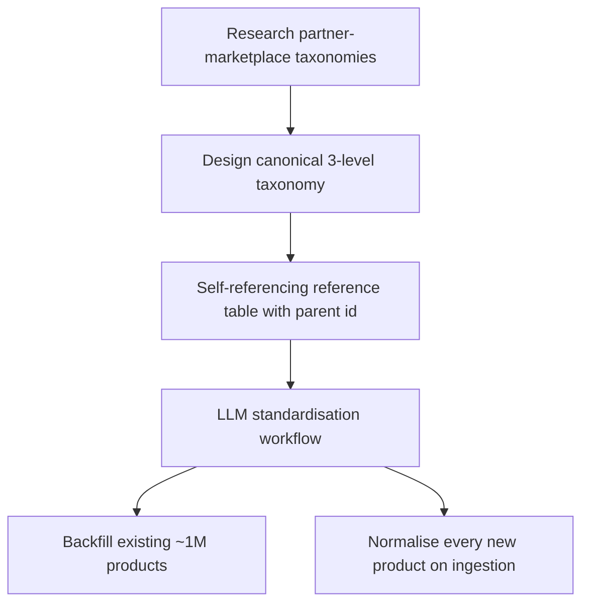
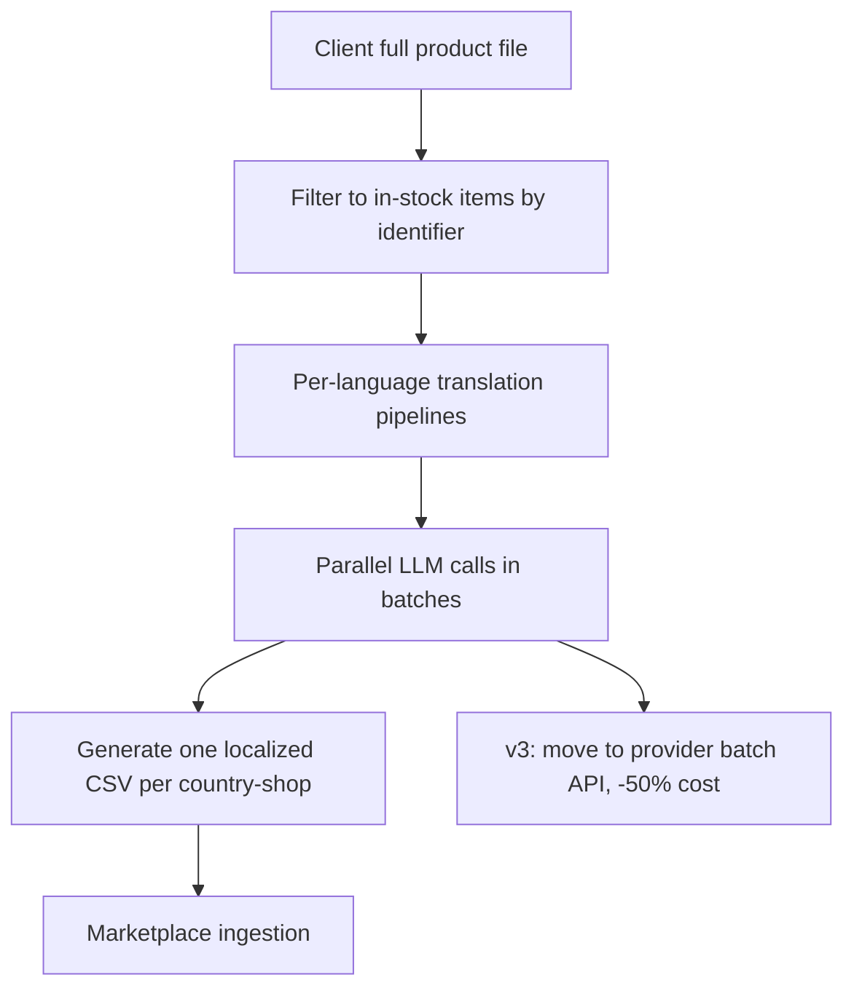
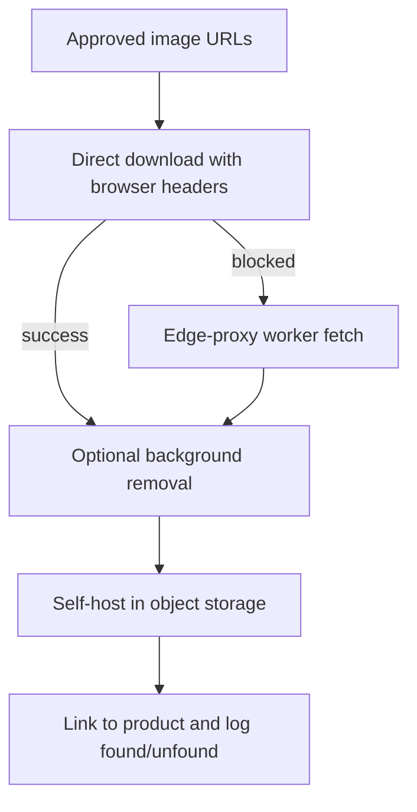

# Automation & Systems Portfolio — Case Studies

Built at a European B2B e-commerce marketplace. Architecture is described at the pattern level;
client and partner names are anonymized and no internal system names are exposed. Quantitative
metrics are real.

---

## 1. Self-Serve Demander Export Tool

At a European B2B e-commerce marketplace, the no-code team was a bottleneck for "demander
exports" — showcase product files the sales team sent to prospective marketplace partners. Each
request took roughly three days (ticket queue, a fragile shared notebook, manual category
cleanup) and pulled an engineer off other work.

I built a self-serve n8n workflow that exposes a form to the sales team. They pick from the
catalogue's canonical category values (levels 1 and 2), which removes category-mismatch at the
input layer, and the workflow then queries the product catalogue directly and returns a ready CSV.

Tools and integrations: n8n (form trigger, parametrised Postgres queries, CSV conversion, file
delivery), Postgres, and Mermaid to spec the flow before building. Turnaround fell from ~3 days
to under 20 minutes, eliminated 100% of the ticket queue for this request type, shipped in ~2
working days (4 calendar days including review), and ran with zero maintenance afterward.

**CV bullets**

- Built a self-serve n8n automation that let a non-technical sales team generate their own
  product-export files, cutting turnaround from ~3 days to under 20 minutes and eliminating 100%
  of the manual ticket queue for that request type.
- Designed the form to constrain inputs to the catalogue's canonical taxonomy, removing
  category-mismatch errors at source and ending the team's dependency on engineering for routine
  exports.
- Spec'd, built, and shipped the workflow in ~2 working days; it ran in production with zero
  maintenance thereafter.

---

## 2. Catalogue Taxonomy Standardization

The marketplace's ~1M-product catalogue had no consistent category taxonomy — mixed languages,
no hierarchy, no canonical list — which broke querying, enrichment, and any attempt to map
products onto partner marketplaces. The work had sat unowned in the backlog.

I designed a canonical three-level taxonomy from scratch by studying how major French retail
marketplaces classified their products, then modeled the hierarchy as a single self-referencing
reference table (category level, definition, examples, parent category id). I wired up LLM-based
standardization workflows that both backfilled the existing million products and normalized every
new product on ingestion.

Tools and integrations: n8n, Postgres (schema design), and an LLM API for category normalization.
The catalogue reached 100% standardization on levels 1 and 2 and ~95-96% on level 3, and the
taxonomy still governs catalogue creation. The million-product rollout was paced deliberately over
weeks to manage token cost and workflow stability (~10 days of build per level).

**CV bullets**

- Designed and shipped a canonical 3-level product taxonomy for a ~1M-product catalogue that
  previously had no consistent classification, unblocking querying, enrichment, and
  partner-marketplace mapping across the company.
- Modeled the hierarchy as a single self-referencing Postgres table and built LLM-based n8n
  workflows that backfilled all existing products and standardize every new product on ingestion,
  reaching 100% coverage on the top two levels and ~95-96% on the third.
- Paced the million-product rollout deliberately over weeks to control LLM token cost and workflow
  stability — an operational call, not a speed compromise.

---

## 3. Multilingual Product-Page Generation

A large European marketplace client wanted its catalogue expanded into five new country-shops,
each of which required product data in its own local language. The blocker was localization at
catalogue scale, not data availability.

I built an n8n pipeline that first filtered the client's full product file down to in-stock items
by product identifier (EAN), then translated each product's fields into all five target languages
via an LLM, then auto-generated one localized CSV per country-shop for ingestion. A first
single-LLM version hallucinated, so I re-architected it into dedicated per-language pipelines
running parallel LLM calls in batches. Months later I moved the translation step onto the LLM
provider's batch API — same output, async-tolerant workload — for a flat 50% token-cost cut.

Tools and integrations: n8n, an LLM API (GPT-4o-mini) and its batch API, Postgres, CSV ingestion.
Localized catalogues went live across five new country-shops within ~5 days of starting; v1 was
designed in ~2 working days.

**CV bullets**

- Built an n8n localization pipeline that filtered a client's full catalogue to in-stock items,
  then used an LLM to translate product data into five languages and auto-generate one localized
  import file per country-shop — taking a multi-country expansion live in ~5 days.
- Diagnosed and fixed a hallucination failure in the first single-LLM design by re-architecting
  into dedicated per-language pipelines running parallel LLM calls in batches.
- Re-engineered the translation step onto the LLM provider's batch API after recognizing the
  workload was async-tolerant, cutting token cost by a flat 50% for identical output.

---

## 4. Image-Ingestion Pipeline

After upstream sourcing produced verified product-image URLs, there was no fast, clean way to get
those images into the system and attached to the right product; the formal route was slow and
manual. I needed something quick and safe to re-run.

I built an n8n workflow that took approved URLs, downloaded each image, optionally ran background
removal via a third-party image API, self-hosted it in object storage (S3), and linked it to the
product — logging every image as "found" or "unfound" so runs were trackable and re-runnable. That
observability surfaced a failure mode: a meaningful share of downloads were being blocked even with
spoofed browser headers. I designed an automatic fallback that reroutes blocked fetches through an
edge-proxy worker (Cloudflare Workers), which fetches from a clean edge server; a teammate built
the worker while I owned the approach and integration.

Tools and integrations: n8n, object storage (S3), a background-removal API, Cloudflare Workers. The
tool went from frequently losing images to blocking, to reliably capturing them, and remains in
production today for product-page creation.

**CV bullets**

- Built an n8n pipeline to ingest verified product images — download, optional background removal,
  self-host in object storage, and attach to the correct product — with found/unfound logging that
  made every run trackable and safe to re-run.
- Used that observability to detect that a meaningful share of downloads were being blocked, then
  designed a two-tier fallback that reroutes blocked fetches through an edge-proxy worker, taking
  the tool from frequently blocked to reliably capturing images.
- Scoped the edge-worker component to a teammate while owning the architecture and integration, and
  shipped a resilient v2 that remains in production for product-page creation.

---

## Code Samples

Sanitized, genericized n8n workflows live in `/workflows`:

- `demander-export-self-serve.sanitized.json` — form → taxonomy-constrained query → CSV export.
- `demand-generation-demander-csv.sanitized.json` — scheduled, incremental per-demander CSV builder.
- `catalogue-creation-automatic-addition.sanitized.json` — four-step idempotent catalogue insertion.

Each file carries a header note. All credentials, internal hostnames, schema/table/column names, and
client identifiers have been removed or replaced with neutral placeholders; control flow and SQL/JS
logic are faithful to the original pattern. These are illustrations, not drop-in imports.
